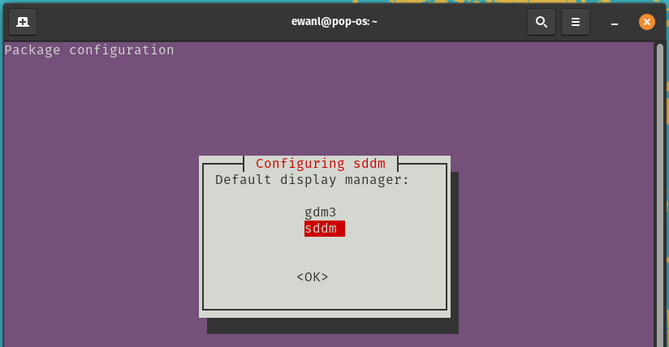
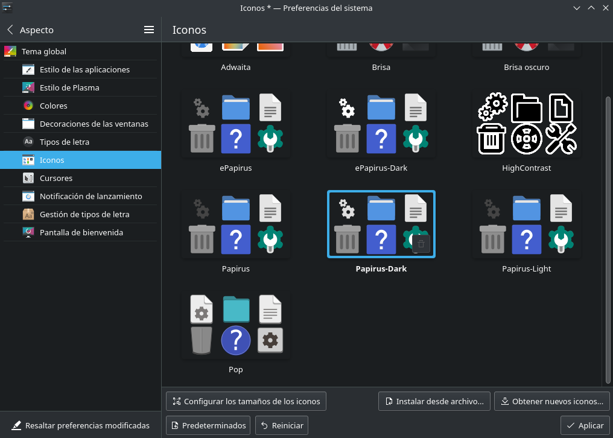
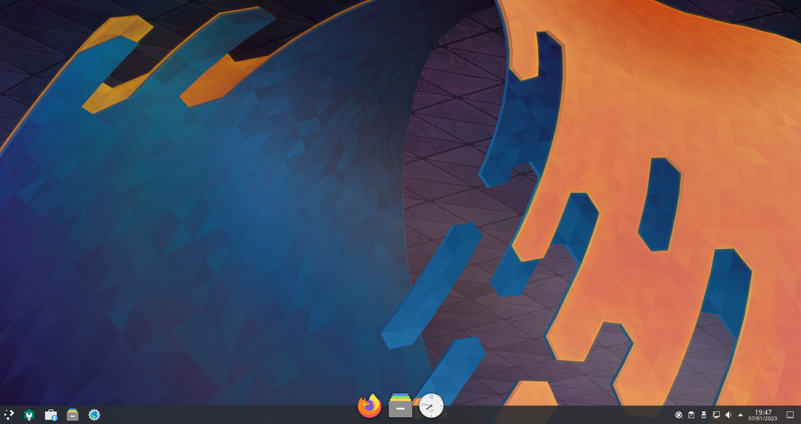
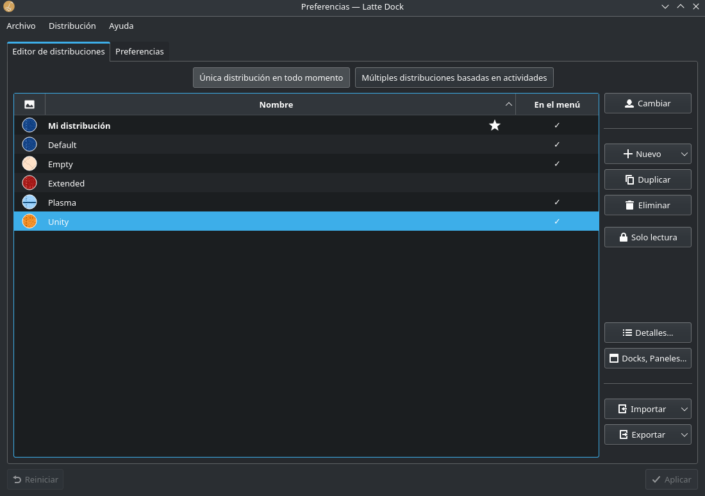
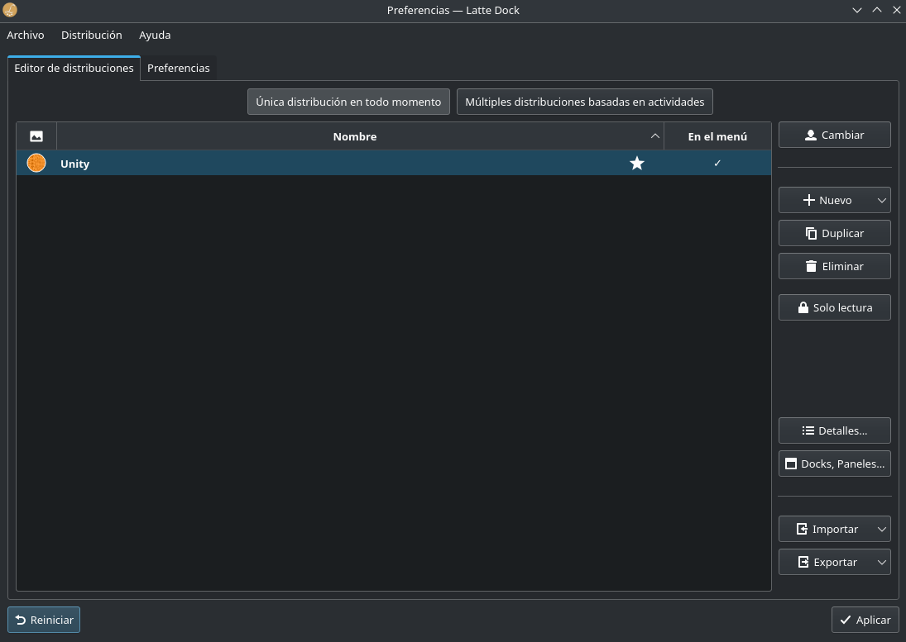
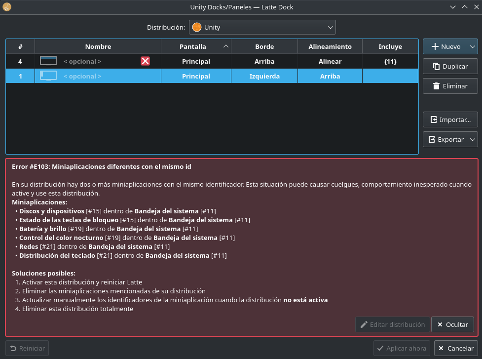

# Como instalar KDE (como tengo yo el gerente de escritorio) en Pop OS

## Instalando KDE

Primero abrir consola y hacer los comandos:

1. Actualizar el equipo:
```
sudo apt update
```

2. Instalar KDE:
```
sudo apt install -y kde-standard
```

> Mientras hacer el comando de instalar, te aparece un menu pidiendo que gerente de display (display manager) quieres elegir. Cuando aparece este opción, das a ok con enter (si no esta seleccionado la opción ok seleccionarlo con tab).


> En el siguiente menú seleccionas la opción de sddm (con teclas de flecha) y dar a enter para seleccionarlo.



## Arreglar teclado de sddm

Antes de reiniciar la maquina, hay que arreglar una cosa con sddm, porque sino siempre abrirá el teclado que ocupa toda la pantalla, por eso hacemos estos comandos para arreglarlo:

```
sudo nano /etc/sddm.conf
```

Después de eso escribimos:
```
InputMethod=
```

Guarda el archivo con `ctrl + X`, `Y (yes)` y dar a Enter

**Después de haber hecho esto, podemos reiniciar para empezar el proceso de personalizar**

## Personalizar para que queda chulo

Primero, tenemos que instalar algunos paquetes.

- Papirus (Iconos personalizados):
```
sudo add-apt-repository ppa:papirus/papirus
sudo apt update
sudo apt install papirus-icon-theme
```

- Latte Dock + Plank
```
sudo apt install -y latte-dock plank
```

Primero, abrimos la aplicación `Preferencias del Sistema`, donde vamos a personalizar la mayoría de cosas.

> Después de cada cambio, hay que hacer click al botón de Aplicar porque si no no se guarda.

1. Cambiamos la tema de modo claro a modo oscuro.


2. Entramos en aspecto donde vamos a configurar la mayoria de las cosas.

3. En la parte de iconos, seleccionamos la opción de `Papirus-Dark`



4. En cursores es como lliurex, das a obtener nuevos cursores y buscas la que quieras (por ejemplo: la de Eevee)

5. Salimos de Preferencias del sistema y abrimos `Latte` (con esto debe abrir algo como el imagen de abajo)



Abrimos la programa una otra vez para abrir su configuración.

Dale click a `Unity` y selecciona la opción `Cambiar`



Cuando has hecho eso, selecciona los demas y dar a la botón de `Eliminar` hasta que solo hay `Unity` y dar a `Aplicar`.



Después de haber hecho esto, da a la opción de `Docks, Paneles...` y `Elimina` la opción de `Borde Izquierda` (ignorar el mensaje de error)



