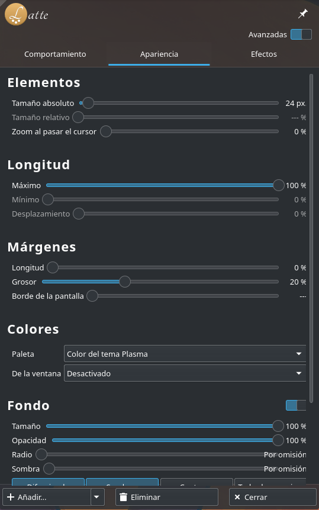
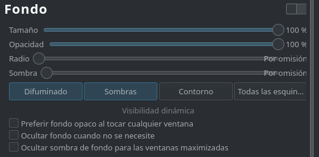
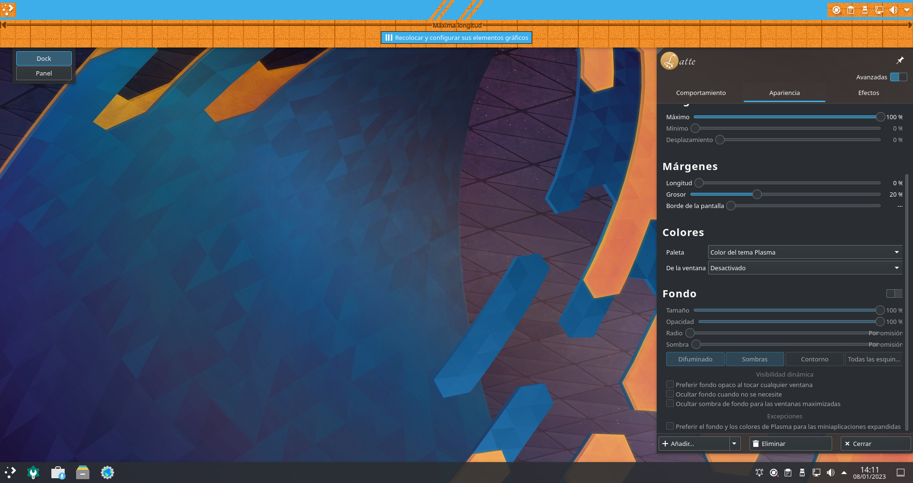
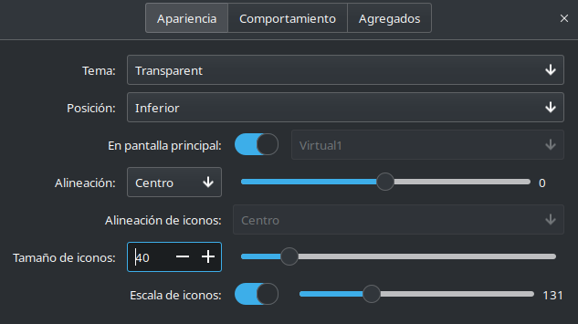
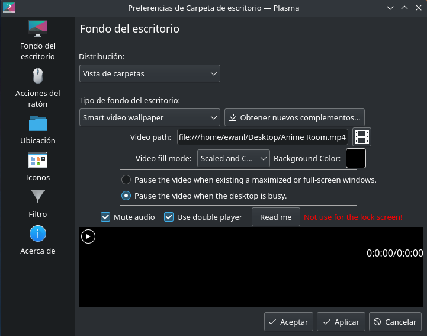

# Como instalar KDE (como tengo yo el gerente de escritorio) en Pop OS

## Instalando KDE

Primero abrir consola y hacer los comandos:

1. Actualizar el equipo:
```
sudo apt update
```

2. Instalar KDE:
```
sudo apt install -y kde-standard
```

> Mientras hacer el comando de instalar, te aparece un menu pidiendo que gerente de display (display manager) quieres elegir. Cuando aparece este opción, das a ok con enter (si no esta seleccionado la opción ok seleccionarlo con tab).


> En el siguiente menú seleccionas la opción de sddm (con teclas de flecha) y dar a enter para seleccionarlo.


## Arreglar teclado de sddm

Antes de reiniciar la maquina, hay que arreglar una cosa con sddm, porque sino siempre abrirá el teclado que ocupa toda la pantalla, por eso hacemos estos comandos para arreglarlo:

```
sudo nano /etc/sddm.conf
```

Después de eso escribimos:
```
InputMethod=
```

Guarda el archivo con `ctrl + X`, `Y (yes)` y dar a Enter

**Después de haber hecho esto, podemos reiniciar para empezar el proceso de personalizar**

## Personalizar para arreglar Packet Tracer

Una cosa que he visto con Packet Tracer es que no funciona con modo oscuro. Entonces lo que hacemos para arreglar eso y no tener que cambiar la tema es tener una configuración única para Packet Tracer. (Es el mismo problema que estaba teniendo yo y Kiko en Arch)

1. Configura como quieras que sea (lo de modo blanco ya está puesto, pero es por si quieres cambiar el cursor, etc.)

2. Comando 1:
```
cp -r ~/.config ~/.configPT
```

3. Comando 2:
```
nano .local/share/applications/cisco-pt.desktop
```

4. Editar (click derecho ➡️ abrir con Kate) y poner esto en la 4ª línea:
```
Exec=export XDG_CONFIG_HOME=~/.configPT; /opt/pt/packettracer %f
```

> Se puede guardar con `Ctrl + X`, `Y` y Enter (Visto arriba en [Arreglar teclado de sddm](https://kdepop.ewan1011.ga/#arreglar-teclado-de-sddm))

Después de haberlo editado, debe parecer algo asi:

``` linenums="1"
[Desktop Entry]
Comment[es_ES]=
Comment=
Exec=export XDG_CONFIG_HOME=~/.configPT; /opt/pt/packettracer %f
GenericName[es_ES]=
GenericName=
Icon=/opt/pt/art/app.png
MimeType=application/x-pkz;application/x-pkt;application/x-pksz;application/x-pks;application/x-pka;
Name[es_ES]=Packet Tracer 8.2
Name=Packet Tracer 8.2
Path=
StartupNotify=true
Terminal=false
TerminalOptions=
Type=Application
X-DBUS-ServiceName=
X-DBUS-StartupType=
X-KDE-SubstituteUID=false
X-KDE-Username=
```

> Solo edita la línea que pone, si no puede romper cosas.

## Personalizar para que queda chulo

Primero, tenemos que instalar algunos paquetes.

- Papirus (Iconos personalizados):
```
sudo add-apt-repository ppa:papirus/papirus
sudo apt update
sudo apt install papirus-icon-theme
```

- Latte Dock + Plank:
```
sudo apt install -y latte-dock plank
```

Primero, abrimos la aplicación `Preferencias del Sistema`, donde vamos a personalizar la mayoría de cosas.

> Después de cada cambio, hay que hacer click al botón de Aplicar porque si no no se guarda.

1. Cambiamos la tema de modo claro a modo oscuro.


2. Entramos en aspecto donde vamos a configurar la mayoria de las cosas.

3. En la parte de iconos, seleccionamos la opción de `Papirus-Dark`


4. En cursores es como lliurex, das a obtener nuevos cursores y buscas la que quieras (por ejemplo: la de Eevee)

5. Salimos de Preferencias del sistema y abrimos `Latte` (con esto debe abrir algo como el imagen de abajo)


- Abrimos la programa una otra vez para abrir su configuración.

- Dale click a `Unity` y selecciona la opción `Cambiar`


- Cuando has hecho eso, selecciona los demas y dar a la botón de `Eliminar` hasta que solo hay `Unity` y dar a `Aplicar`.


- Después de haber hecho esto, da a la opción de `Docks, Paneles...` y `Elimina` la opción de `Borde Izquierda` (ignorar el mensaje de error). Después de haber hecho eso, dar a `Aplicar ahora`


> Después de eso, podemos cerrar la aplicación de `Latte`

- Hacer click derecho al panel de `Latte` de arriba, y selecciona la opción de `Editar panel...`

> Con esto aparecerá la ventana de `Latte`

- Primero seleccionamos opciones avanzadas, y imos a la pestaña de `Apariencia`



- En `Elementos`, cambiamos el `Tamaño absoluto` de 24px a 30 px

- Bajamos hasta que encontramos `Fondo` donde desactivamos directamente la opción.



- Después de eso, haz click en la opción de `Recolocar y configurar sus elementos gráficos`

- Poniendo el ratón sobre algo te deja borrar, mover, etc.

> (es dificil enseñarlo con fotos, pero puedo enseñar como parece al final)



- Dale otra vez a la opción de `Recolocar y configurar sus elementos gráficos` 

- Ahora hacer click derecho al panel como antes, pero ahora selecciona la opción de `Añadir elementos gráficos...`

- Haz click a la opción de `⭐ Get new Widgets...`, `Descargar nuevos elementos gráficos de Plasma`

- Busca `Event Calendar` y `Instalar`

- Otra vez, click derecho al panel, opción `Añadir elementos gráficos...`

- Busca `Event Calendar`

- Arrastrarlo al parte medio del panel para colocarlo alli.

- Cerrar el modo de editar dando al botón de `Cerrar` de Latte.

> No lo voy a explicar aqui pero haciendo click derecho al calendario, te deja cambiar algunas cosas como vincular el calendario de Google, etc.

6. Arreglar boton de windows no funcionando (puede ser que funciona, prueba primero)

- Para arreglar el boton de windows para que funciona con `Latte`, tenemos que hacer estos comandos:

```
kwriteconfig5 --file ~/.config/kwinrc --group ModifierOnlyShortcuts --key Meta "org.kde.lattedock,/Latte,org.kde.LatteDock,activateLauncherMenu"
qdbus org.kde.KWin /KWin reconfigure
```

7. Configuración de Plank

- Primero hacer click derecho en el panel de abajo, y seleccionar la opción de `Entrar en el modo de edición`

- `Más opciones`, `Eliminar panel`

- Abrir `Plank`

- Hacer click derecho en el dock de abajo hasta que te aparece algo que tiene una opción llamada `Preferencias`

> Tienes que hacerlo múy prefijamente al borde, si no no detecta y enseña las opciones de la aplicación arrastrada

- Hacer que tus `Preferencias` aparecen asi:



> Para cambiar los aplicaciones puedes hacer click derecho sobre ellos y seleccionar la opción de añadir/quitar del dock

8. Cambiar el fondo del Escritorio para que sea animada

- Click derecho, opción `Configurar el escritorio y la imagen de fondo`

- Botón `⬇️ Obtener nuevos complementos...`

- Busca SmartER Video Wallpaper, `Instalar`

- Comandos para arreglar el video (sin no aparece como un fondo negro.):

```
sudo apt install -y libgstreamer1.0-0 gstreamer1.0-plugins-base gstreamer1.0-plugins-good gstreamer1.0-plugins-bad gstreamer1.0-plugins-ugly gstreamer1.0-libav
```

> Reiniciar después de hacer esto

- Selecciona el plugin y el video que quieres poner y dar a `Aplicar`



> Con esto ya no hace falta Hidamari, entonces puedes desinstalarlo

9. Personalizar la pantalla de Bienvenida

- Abrir `Preferencias del Sistema` y busca `Pantalla de bienvenida`

- Puedes usar el de defecto, o buscar otro en `Obtener nuevas...`

10. Personalizar sddm

- Primero en las `Preferencias del Sistema` entra en el apartado de `Arranque y Apagado`

- Dale a los 3 puntitos de abajo y selecciona `Obtener nuevos temas SDDM...`

- Puedes seleccionar la que quieras, la que voy a explicar aqui es la que uso yo, porque hace falta algun cambio para que sea animada.

- Para instalar, tenemos que hacer algunas cosas para que sea animada, por ahora cierra las `Preferencias del Sistema`

- Para que sea animada, tenemos que instalar un paquete de github, que se puede hacer con los comandos:

```
git clone https://github.com/Catvert/kde-plasma-chili.git
sudo mv kde-plasma-chili/ /usr/share/sddm/themes
sudo nano /usr/share/sddm/themes/kde-plasma-chili/theme.conf
```

> Cuando estas dentro de nano (editor de archivos) cambia las opciones `ScreenWidth` y `ScreenHeight` para que sean:

```
ScreenWidth=1920
ScreenHeight=1080
```

Ahora en el apartado de `Arranque y Apagado` (visto antes) seleccionalo (KDE Plasma Chili) y da a la opción de Aplicar (puede que te pide contraseña)

## Notas antes de acabar

Comando útil para quitar paquetes que no hace falta:

```
sudo apt autoremove
```

También si te da algún error, pide por WhatsApp o preguntame en clase (ahora sueno como un profe xd)